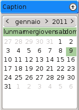
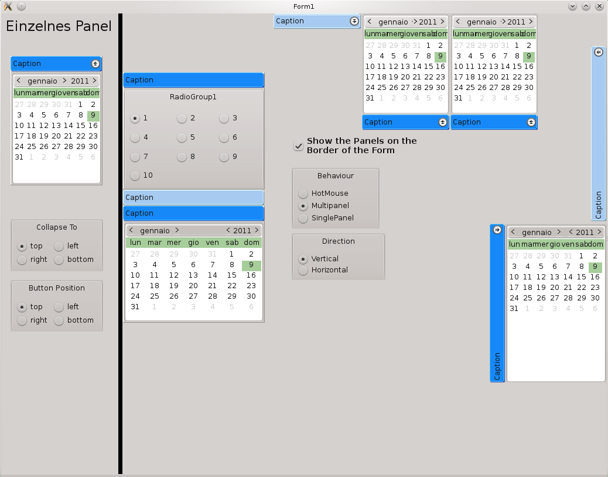

# TMyRollOut and ExpandPanel

These are [Lazarus](http://www.lazarus-ide.org/) components. More infos please check the [TMyRollOut and ExpandPanel wiki](http://wiki.lazarus.freepascal.org/TMyRollOut_and_ExpandPanel).

* TMyRollOut is a visual component. It is a Panel that collapses when clicked on the button.
 			  
*  TExpandPanels a non visual component. It arranges multiple TMyRollOut instances beneath/side-by-side to each other to save space.


## Usage

### Components installed in Lazarus
After installing both components into Lazarus, you can add multiple TMyRollOut instances (myrollout1, myrollout2, etc.) to the form. To arrange them beneath each other you have to add the TMyRollOut instances to a expandpanel (in OnCreate) with the command:
```
expandpanel1.AddPanel(myrollout1);
expandpanel1.AddPanel(myrollout2);
```

### Components *not* installed in Lazarus
If you want to create all the components during runtime (like in the development example), you have to execute:
```
expandpanel1:=TExpandPanels.create(self);
myrollout1:=TMyRollOut.Create(self);
myrollout1.Parent:=self;
expandpanel1.AddPanel(myrollout1);
```
and then  add them to the expandpanel1
```
expandpanel1.AddPanel(myrollout1);
expandpanel1.AddPanel(myrollout2);
```

## Demo Project

